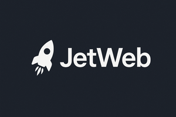

<p align="center">
    
</p>


Documentation: https://nazariikuntsevych.github.io/jetweb/.

---

# JetWeb

JetWeb is a lightweight Python WSGI-compatible web framework, designed for simplicity, minimalism, and flexibility.

## Features

* WSGI-compatible.
* Zero dependencies.
* Function-based and class-based request handlers.
* HTTP exception handlers.
* Middlewares.
* Dynamic routing with converters.
* Dependency injection with request context.
* Covered by automated tests.

## Installation

```shell
$ pip install git+ssh://git@github.com/NazariiKuntsevych/jetweb.git
```

## Licensing

The code in this project is licensed under MIT license.
